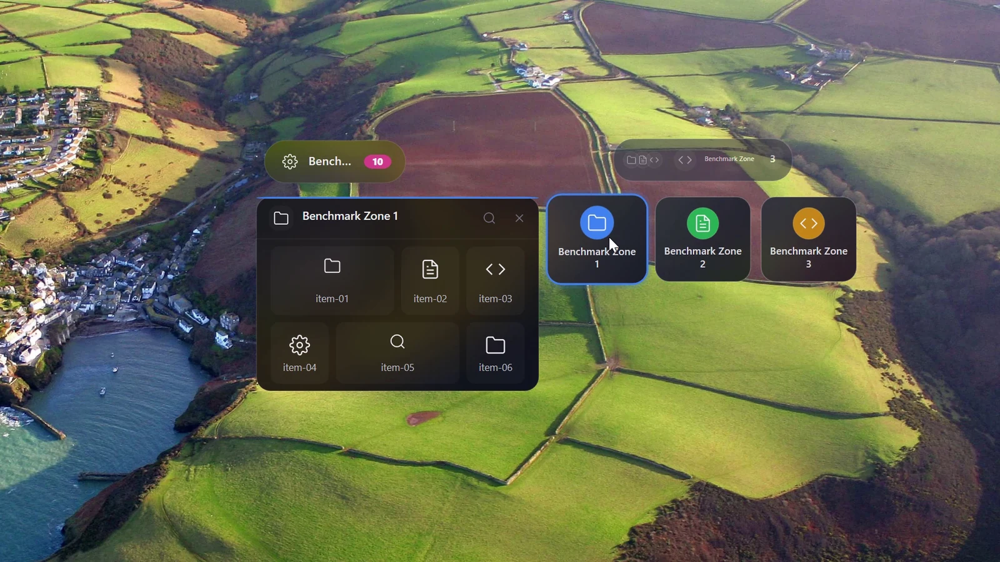

<div align="center">
  

  # BentoDesk

  **A fast, elegant, bento-box desktop organizer for Windows — built from the ground up in Rust.**

  [English](README.md) · [简体中文](README.zh-CN.md)

  <p><a href="https://github.com/ZRainbow1275/bentodesk/releases/latest"></a> <a href="https://github.com/ZRainbow1275/bentodesk/releases"></a> <a href="https://github.com/ZRainbow1275/bentodesk/stargazers"></a> <a href="https://github.com/ZRainbow1275/bentodesk/actions/workflows/ci.yml"></a> <a href="#requirements"></a> <a href="Cargo.toml"></a> <a href="LICENSE"></a></p>

  <p>
    <a href="https://github.com/ZRainbow1275/bentodesk/releases/latest">Download</a> ·
    <a href="#zones-that-stay-out-of-the-way">See it in motion</a> ·
    <a href="#what-bentodesk-does">Features</a> ·
    <a href="#building-from-source">Build</a> ·
    <a href="#contributing">Contributing</a>
  </p>
</div>

<p align="center">
  
</p>

## Why BentoDesk

I keep active work on the desktop because I want it within reach. A few
projects later, that visibility turns into noise.

BentoDesk is my answer to that problem. It gives files a place without hiding
them in another full-screen app: a Zone rests as a small capsule, opens when
needed, and can join other Zones in a Stack. The files remain ordinary Windows
files.

Version 2.0 is a native Rust rewrite. It keeps the practical ideas from the
Tauri-based 1.x releases while replacing the web runtime and rebuilding the
motion, typography, file handling, settings, and system integration around
Windows itself.

## Four things that matter

| | |
| --- | --- |
| **Lean** | One native process, no bundled browser runtime. Release builds are about 2.5 MB; the isolated five-Zone reference run used 16.60 MiB of Private Bytes at t60. |
| **Coherent** | Collapsed and expanded Zones use the same geometry, hit testing, typography, and animation state instead of swapping between separate visual layers. |
| **Direct** | Shell/OLE drag and drop, Windows icons, search, Stacks, batch layouts, snapshots, and the timeline work with real desktop content. |
| **Local** | No account or cloud is required. State is written atomically; settings support DPAPI or passphrase encryption, and plugin packages are checked before installation. |

## Choosing a desktop organizer

The products below solve different versions of “my desktop is full.” This is a
workflow comparison, based on each product's official documentation—not a
synthetic benchmark.

| Start with | When it is the better fit |
| --- | --- |
| [Windows folders and desktop icons](https://support.microsoft.com/en-us/windows/experience/personalization/customize-the-desktop-icons-in-windows) | You want no extra software. Windows gives you familiar, resizable icons and shortcuts that can be shown or hidden; folders still open in Explorer. |
| [Stardock Fences 6](https://www.stardock.com/products/fences/) | You need extensive automation or managed-PC deployment. It combines Fence groups and mirrored Folder Portals with sorting rules, tabs, Peek, customization, and business deployment. |
| [Portals](https://portals-app.com/) | You want persistent folder panels and precise visual control. Portals mirrors selected folders through panels and tabs, with per-portal styling, saved layouts, display-aware switching, and settings profiles. |
| [Nimi Places](https://mynimi.net/Projects/Nimi-Places/Features/) | Rich previews matter most. Its conditional containers show chosen locations with icons or thumbnails and add media preview, labels, sorting, and rules. |
| **BentoDesk** | You want an inspectable, local-first organizer whose resting state stays small. Zones expand from capsules into grids, combine as Stacks, and add continuous native motion, direct desktop-item handling, batch layouts, snapshots, and timeline recovery. |

BentoDesk is deliberately narrower: it is Windows-only, does not replace
Explorer, and does not provide cloud-account sync. It focuses on the
capsule-to-grid Zone workflow, fast motion, Stacks, and recoverable local state.
If a permanent folder portal, rich media preview, or managed deployment is
central to your work, choose the product built around it.

## What BentoDesk does

### Zones that stay out of the way

A Zone can be narrow or wide, use five corner styles, and open on hover, click,
or remain expanded. Its icon, title, count badge, search, item grid, and context
menu all belong to one native surface. Rapid reversal and movement between
Zones continue the current motion instead of restarting it.

<p align="center">
  
</p>
<p align="center">
  <sub>Native Windows build · <a href="docs/media/zone-motion.mp4">watch the MP4</a></sub>
</p>

### Drag, search, and Stack

- Move or copy files, folders, and shortcuts with Windows Shell/OLE drag and
  drop; drag an item back out to restore it to the desktop.
- Filter one Zone in place or search across all Zones.
- Combine Zones into a Stack, then bloom its members without losing their
  individual layout or style.
- Keep empty desktop space click-through while normal application windows cover
  BentoDesk as expected.

### Edit one Zone or manage them together

Names, aliases, icons, accents, grid columns, widths, and corners are editable
without opening a browser-backed window.

<p align="center">
  
</p>

The batch manager can select, show, hide, move, or delete Zones and apply grid,
horizontal, vertical, ring, or natural layouts while keeping every Zone inside
the usable display area.

<p align="center">
  
</p>

### Settings and themes

Settings is a normal native window: centered on first open, draggable,
scrollable, dismissible, and not forced above other applications. It includes
light and dark themes, accents, expansion behavior, performance controls,
startup options, backup, encryption, plugins, and updater settings.

<p align="center">
  
</p>

English and Simplified Chinese ship together. First launch follows the Windows
UI language; either language can be selected later in Settings.

### Automation without surrendering control

- **Smart grouping** turns current desktop files into reviewable suggestions;
  nothing is reorganized until you apply a suggestion.
- **Live folders** keep a bound directory and its Zone in sync.
- **Plugins** can be installed from validated local packages, enabled, disabled,
  persisted, and removed with confirmation.
- **Rules** support repeatable local organization without requiring an online
  service.

### Recovery and Windows integration

Save and load layout snapshots, inspect structural changes on the timeline, and
restore a previous arrangement. The tray menu and global hotkeys open the native
management tools. Settings backups, atomic persistence, update-package
validation, and encrypted vault options provide recovery paths without a helper
browser process.

## Quick start

1. Download `BentoDesk-2.0.1-windows-x64-portable.zip` from
   [Releases](https://github.com/ZRainbow1275/bentodesk/releases/latest).
2. Check the archive against `SHA256SUMS.txt`, extract it to a writable
   directory, and run `BentoDesk.exe`.
3. Create or manage Zones from the tray menu.
4. Drag files, folders, or shortcuts into a Zone.
5. Choose a theme, expansion mode, and language in Settings.

The portable package needs no Node.js, Tauri, WebView2, or separate browser
runtime. State lives in the current user profile by default; portable mode can
keep it beside the executable.

### File safety

Drag and drop follows Windows move/copy semantics. Destructive Zone and snapshot
actions require confirmation, and failed or rejected transfers are not treated
as completed. Keep irreplaceable files backed up as you would with any desktop
file tool.

### Requirements

- Windows 10 1809+ or Windows 11;
- x86-64 processor;
- current Windows updates and graphics drivers are recommended.

## Reference measurement

One isolated Windows x64 run with five Zones, 50 items, and one BentoDesk
process:

| Metric | Result |
| --- | ---: |
| Release EXE | about 2.5 MB |
| Private Bytes at t10 / t30 / t60 | 16.41 / 16.60 / 16.60 MiB |
| Full Zone expand / collapse | 234 ms / 235 ms |
| Animation tick median / p95 | 16 ms / 16 ms |

## Technology

| Layer | Implementation |
| --- | --- |
| Language and runtime | Rust 2024, single process |
| Windows and input | Win32 / USER32 / DWM |
| Graphics | Direct2D, DirectWrite, DirectComposition, D3D11 |
| Icons and images | Windows Imaging Component, Windows Shell |
| File interaction | Shell/OLE, `ReadDirectoryChangesW` |
| Network and system security | WinHTTP, DPAPI |
| Data | Atomic local persistence, encrypted settings vault |
| Build | MSVC x64, static CRT, size optimization, Fat LTO |

BentoDesk 2.0 does not ship Tauri, WebView2, Chromium, Node.js, or a third-party
GUI framework in its runtime. The Tauri 1.x code remains available at
[`v1.3.0`](https://github.com/ZRainbow1275/bentodesk/tree/v1.3.0) and
[`archive/tauri-1.x`](https://github.com/ZRainbow1275/bentodesk/tree/archive/tauri-1.x).

Primary crates:

```text
bentodesk-shell      Process entry, Win32 message routing, system integration
bentodesk-app        Application state, interaction, render projection
bentodesk-backend    Settings, plugins, rules, recovery, updater
bentodesk-platform   D2D/DWrite/DComp/WIC/Shell/OLE boundaries
bentodesk-zone       Zone domain model
bentodesk-style      Themes, typography, and visual tokens
```

## Building from source

You need Windows 10/11 x64, Rust 1.89 or newer, and Visual Studio 2022 Build
Tools with MSVC and the Windows SDK.

```powershell
git clone https://github.com/ZRainbow1275/bentodesk.git
cd bentodesk

$env:CARGO_BUILD_JOBS = "1"
$env:CARGO_INCREMENTAL = "0"
cargo build --locked --release --target x86_64-pc-windows-msvc -p bentodesk-shell --bin BentoDesk
```

Output:

```text
target\x86_64-pc-windows-msvc\release\BentoDesk.exe
```

Full local checks:

```powershell
cargo fmt --all -- --check
cargo test --locked --workspace --all-targets
cargo clippy --locked --workspace --all-targets -- -D warnings
cargo doc --locked --workspace --no-deps
cargo deny check
cargo audit
```

## Contributing

Code, tests, translations, themes, plugins, documentation, and focused bug
reports are welcome. Issues and pull requests may be written in English or
Chinese. Start with [CONTRIBUTING.md](CONTRIBUTING.md).

Report security issues through GitHub's private channel described in
[SECURITY.md](SECURITY.md), not in a public issue.

## Thanks

Thanks to [Tibo](https://x.com/thsottiaux) for the product inspiration, and to
the Linux Do community for discussion and testing.

BentoDesk is maintained by 方寒
([@ZRainbow1275](https://github.com/ZRainbow1275)).

## License

BentoDesk is released under the [GNU AGPL-3.0-or-later](LICENSE).
