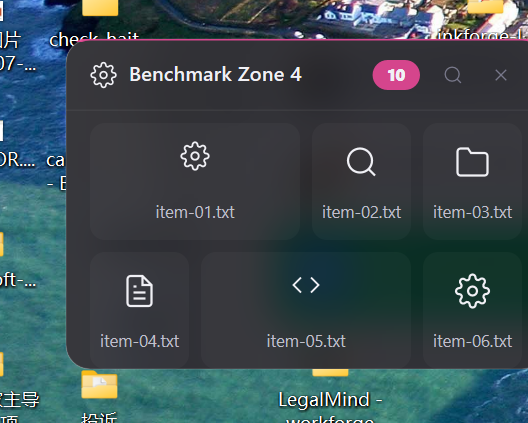

<div align="center">
  

  # BentoDesk Nano

  **把文件、文件夹和快捷方式收进安静的桌面 Zone。**

  [](https://github.com/ZRainbow1275/bentodesk-nano)
  [](https://www.rust-lang.org/)
  [](#技术栈)
  [](LICENSE)

  [简体中文](#简体中文) · [English](#english)
</div>

---

## 简体中文

BentoDesk 是一款 Windows 桌面整理工具。它把散落的文件、文件夹和快捷方式收进可展开的 Zone：平时安静地贴在桌面上，需要时再打开。

整个界面由 Rust、Win32、Direct2D、DirectWrite 与 DirectComposition 直接实现。没有 WebView，没有 Chromium，也不依赖 Tauri 运行时。

<p align="center">
  
</p>

### 特色

- **桌面 Zone**：胶囊、展开面板、堆叠、搜索、拖放与右键操作使用同一套真实状态。
- **原生文件体验**：读取 Windows 图标，支持 Shell/OLE 拖放、文件夹绑定和桌面源监视。
- **整理工具**：智能分组建议、批量管理、布局快照和时间线均直接操作真实数据。
- **外观与交互**：多套明暗主题、强调色、Zone 尺寸、边角和悬停/单击/常驻展开模式。
- **插件**：支持本地插件包的安装、启停、持久化与确认卸载。
- **中英双语**：中文系统默认中文，其他系统默认英文；可在设置中随时切换。

### 界面

<table>
  <tr>
    <td width="50%" align="center">
      
      <br><sub>区域编辑器</sub>
    </td>
    <td width="50%" align="center">
      
      <br><sub>主题与外观</sub>
    </td>
  </tr>
  <tr>
    <td colspan="2" align="center">
      
      <br><sub>批量管理</sub>
    </td>
  </tr>
</table>

### 技术栈

| 层 | 实现 |
| --- | --- |
| 语言与运行时 | Rust 2024，单进程 |
| 窗口与输入 | Win32 / USER32 / DWM |
| 图形 | Direct2D、DirectWrite、DirectComposition、D3D11 |
| 系统集成 | Windows Shell/OLE、WIC、WinHTTP、DPAPI、ReadDirectoryChangesW |
| 数据 | 本地原子写入、加密设置仓库、无云端必需服务 |
| 发布 | MSVC x64、静态 CRT、`opt-level = "z"`、Fat LTO |

### 当前发布候选实测

以下数字来自 Windows x64、隔离五 Zone 场景，不作为所有机器的固定值：

| 指标 | 结果 |
| --- | ---: |
| Release 可执行文件 | 2.37 MiB |
| 动画采集后 Private Bytes | 25.86 MiB |
| 空闲 60 秒 Private Bytes | 21.59 MiB |
| Zone 展开/收起/反转采样 | 约 60 FPS |

### 下载与运行

1. 从 [Releases](https://github.com/ZRainbow1275/bentodesk-nano/releases) 下载 Windows x64 压缩包。
2. 解压后运行 `bento-nano-shell.exe`。
3. 通过托盘菜单打开设置、关于和管理工具。

程序数据保存在当前用户目录；便携模式可在设置中启用。首次运行不需要 Node.js、WebView2 或额外浏览器内核。

### 从源码构建

要求：

- Windows 10/11 x64
- Rust `1.85+`
- Visual Studio 2022 Build Tools（MSVC 与 Windows SDK）

```powershell
$env:CARGO_BUILD_JOBS = "1"
$env:CARGO_INCREMENTAL = "0"
cargo build --release --target x86_64-pc-windows-msvc
```

输出：

```text
target\x86_64-pc-windows-msvc\release\bento-nano-shell.exe
```

### 许可证

BentoDesk Nano 以 [GNU AGPL-3.0-or-later](LICENSE) 发布。

作者：方寒（[@ZRainbow1275](https://github.com/ZRainbow1275)）

---

## English

BentoDesk is a Windows desktop organizer for files, folders, and shortcuts. It keeps them in expandable Zones that stay quiet on the desktop until they are needed.

The interface is built directly with Rust, Win32, Direct2D, DirectWrite, and DirectComposition. There is no WebView, Chromium, or Tauri runtime.

<p align="center">
  
</p>

### Highlights

- **Desktop Zones** — capsules, expanded panels, stacks, search, drag-and-drop, and context actions share one real state.
- **Native file behavior** — Windows icons, Shell/OLE drag-and-drop, bound folders, and desktop source watching.
- **Organization tools** — smart grouping suggestions, bulk management, layout snapshots, and timeline history.
- **Appearance and motion** — light and dark themes, accents, Zone sizes, corner styles, and hover/click/always display modes.
- **Plugins** — local package installation, enable/disable persistence, and confirmed uninstall.
- **Chinese and English** — the initial locale follows Windows and can be changed in Settings at any time.

### Native stack

| Layer | Implementation |
| --- | --- |
| Language and runtime | Rust 2024, single process |
| Windows and input | Win32 / USER32 / DWM |
| Graphics | Direct2D, DirectWrite, DirectComposition, D3D11 |
| System integration | Windows Shell/OLE, WIC, WinHTTP, DPAPI, ReadDirectoryChangesW |
| Data | Atomic local storage, encrypted settings vault, no required cloud service |
| Release profile | MSVC x64, static CRT, size optimization, Fat LTO |

### Measured release candidate

Measured on Windows x64 with an isolated five-Zone scene; results vary by machine:

| Metric | Result |
| --- | ---: |
| Release executable | 2.37 MiB |
| Private Bytes after animation capture | 25.86 MiB |
| Private Bytes after 60 seconds idle | 21.59 MiB |
| Zone expand/collapse/reversal capture | about 60 FPS |

### Build

Requirements:

- Windows 10/11 x64
- Rust `1.85+`
- Visual Studio 2022 Build Tools with MSVC and the Windows SDK

```powershell
$env:CARGO_BUILD_JOBS = "1"
$env:CARGO_INCREMENTAL = "0"
cargo build --release --target x86_64-pc-windows-msvc
```

The executable is written to:

```text
target\x86_64-pc-windows-msvc\release\bento-nano-shell.exe
```

### License

BentoDesk Nano is released under [GNU AGPL-3.0-or-later](LICENSE).

Created by Fang Han ([@ZRainbow1275](https://github.com/ZRainbow1275)).
