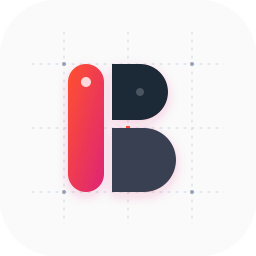
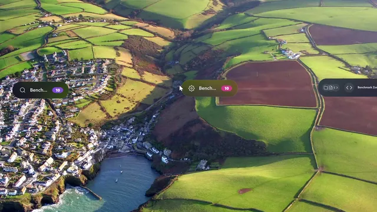
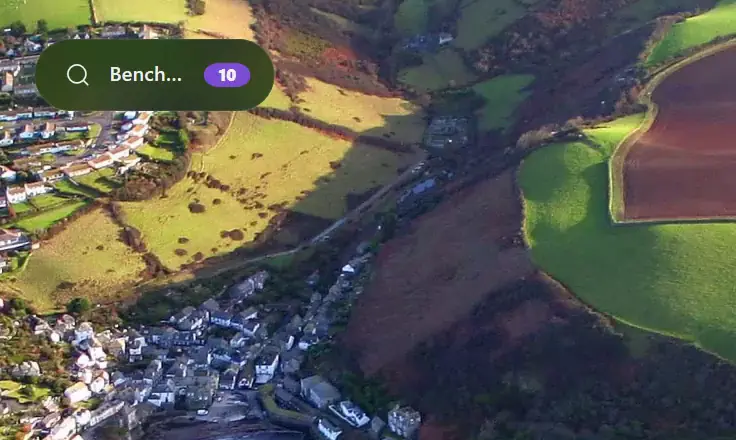
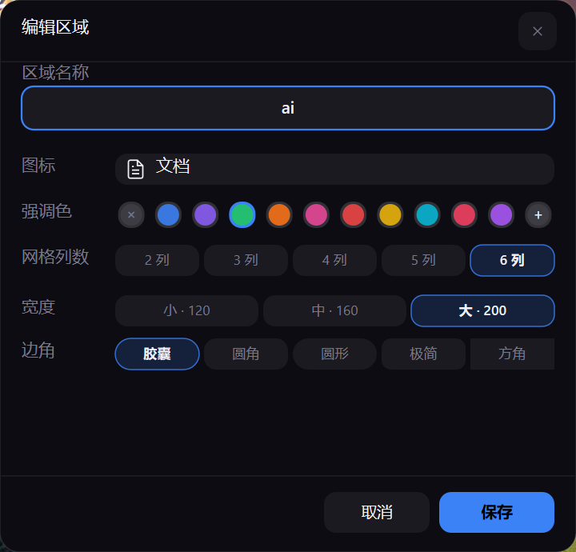
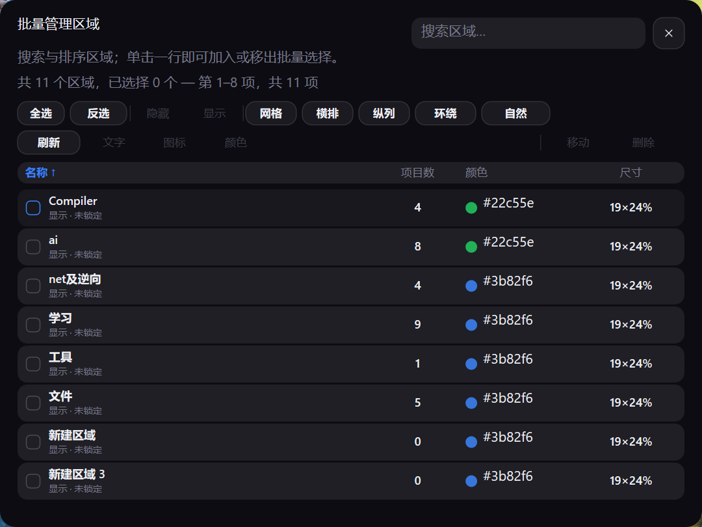
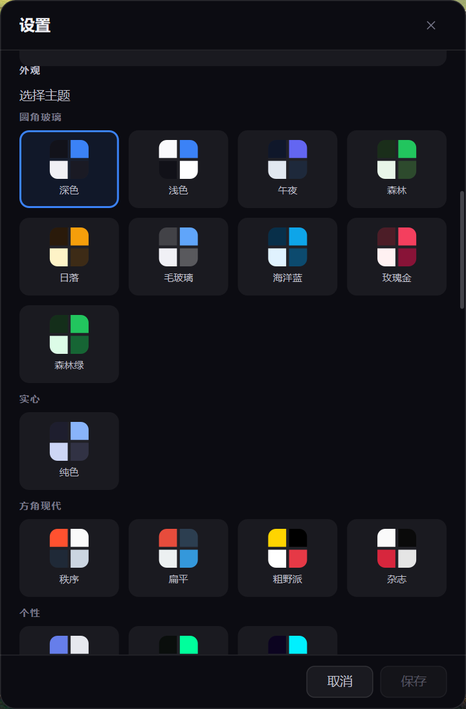

<div align="center">
  

  # BentoDesk

  **由 Rust 驱动，极致优雅的下一代便当盒式 Windows 桌面整理器。**

  [English](README.md) · [简体中文](README.zh-CN.md)

  <p><a href="https://github.com/ZRainbow1275/bentodesk/releases/latest"></a> <a href="https://github.com/ZRainbow1275/bentodesk/releases"></a> <a href="https://github.com/ZRainbow1275/bentodesk/stargazers"></a> <a href="https://github.com/ZRainbow1275/bentodesk/actions/workflows/ci.yml"></a> <a href="#系统要求"></a> <a href="Cargo.toml"></a> <a href="LICENSE"></a></p>

  <p>
    <a href="https://github.com/ZRainbow1275/bentodesk/releases/latest">下载</a> ·
    <a href="docs/media/desktop-tour.mp4">观看演示</a> ·
    <a href="#bentodesk-能做什么">功能</a> ·
    <a href="#从源码构建">构建</a> ·
    <a href="#参与贡献">贡献</a>
  </p>
</div>

<p align="center">
  <a href="docs/media/desktop-tour.mp4"></a>
</p>
<p align="center">
  <sub>三十三秒，一个原生进程，把桌面折叠起来。 · <a href="docs/media/desktop-tour.mp4">播放 MP4</a></sub>
</p>

## 为什么做 BentoDesk

我习惯把正在做的东西都放在桌面上，随手可见。项目一多，桌面也很快堆成了
垃圾场。

BentoDesk 最初就是为了解决这个问题。它不把文件藏进另一个全屏软件，而是
给它们一个位置：Zone 平时收成一枚小胶囊，需要时再展开，也可以和其他 Zone
组成 Stack。文件仍是普通的 Windows 文件。

2.0 用 Rust 和 Windows 原生图形栈重写。Tauri 1.x 中实用的部分被保留下来，
网页运行时则被彻底移除；动画、排版、文件处理、设置与系统集成都按 Windows
桌面软件重新完成。

## 四个特点

| | |
| --- | --- |
| **极致** | 单进程原生运行，不携带浏览器内核。Release 构建约 2.5 MB；隔离五 Zone 参考场景下 t60 Private Bytes 为 21.57 MiB。 |
| **优雅** | 收起和展开共用几何、命中、排版与动画状态，不再切换两套互相脱节的图层。 |
| **便捷** | Shell/OLE 拖放、Windows 图标、搜索、Stack、批量排列、快照与时间线都直接作用于真实桌面内容。 |
| **安全** | 无需账号或云服务；状态原子写入，设置支持 DPAPI 或口令加密，插件包安装前会经过校验。 |

## 如何选择桌面整理器

下面这些软件解决的是不同版本的“桌面放满了”。对照内容来自各产品的官方
说明，只比较工作方式，不拿合成跑分代替真实体验。

| 可以先看 | 它更适合什么情况 |
| --- | --- |
| [Windows 文件夹与桌面图标](https://support.microsoft.com/zh-cn/windows/experience/personalization/customize-the-desktop-icons-in-windows) | 不想安装额外软件。Windows 已经提供熟悉、可缩放、可整体隐藏的图标与快捷方式，文件夹仍由 Explorer 打开。 |
| [Stardock Fences 6](https://www.stardock.com/products/fences/) | 看重丰富自动整理或受管电脑部署。它把围栏和映射文件夹的 Folder Portal 放在一起，并提供排序规则、标签页、Peek、外观定制与企业部署。 |
| [Portals](https://portals-app.com/) | 想要常驻文件夹面板与精确外观控制。Portals 通过面板和标签页映射指定文件夹，并提供逐面板定制、布局保存、随显示器切换与设置档案。 |
| [Nimi Places](https://mynimi.net/Projects/Nimi-Places/Features/) | 最看重丰富预览。它用按条件显示的容器呈现指定位置，支持图标、缩略图、媒体预览、标签、排序与规则。 |
| **BentoDesk** | 想要可审查、本地优先，而且静止时尽量少占桌面的整理器。Zone 从胶囊展开为网格，也能组成 Stack，并提供连续原生动画、真实桌面项目、批量布局、快照与时间线恢复。 |

BentoDesk 刻意收窄了范围：只支持 Windows，不替代 Explorer，也不提供云账号
同步。它专注于胶囊到网格的 Zone、快速动画、Stack 与可恢复的本地状态。如果
常驻文件夹门户、丰富媒体预览或受管部署才是核心需求，就选择专门为它设计的
产品。

## BentoDesk 能做什么

### 安静地待在桌面上

Zone 可以选择宽度与五种边角，也可以悬停展开、单击展开或常驻展开。图标、
标题、数量徽标、搜索、项目网格与右键菜单都在同一个原生表面上。动画反向或
快速移动到另一个 Zone 时，会从当前进度继续，不重新跳一遍。

<p align="center">
  <a href="docs/media/zone-motion.mp4"></a>
</p>
<p align="center">
  <sub>胶囊、网格、搜索与右键菜单，共用一个原生表面。 · <a href="docs/media/zone-motion.mp4">播放 MP4</a></sub>
</p>

### 拖放、搜索与 Stack

- 通过 Windows Shell/OLE 移动或复制文件、文件夹与快捷方式，也可以拖回桌面；
- 在一个 Zone 内筛选，或跨全部 Zone 搜索；
- 把多个 Zone 组成 Stack，再展开成员，同时保留各自布局和样式；
- 桌面空白区域保持点击穿透，普通应用窗口可以正常覆盖 BentoDesk。

### 编辑一个 Zone，或一次管理全部

名称、别名、图标、强调色、网格列数、宽度与边角都能直接编辑，不会打开
依赖浏览器内核的窗口。

<p align="center">
  
</p>

批量管理可以选择、显示、隐藏、移动或删除 Zone，并应用网格、横排、纵列、
环绕和自然五种布局；排列结果会留在可用屏幕范围内。

<p align="center">
  
</p>

### 设置与主题

设置是普通的原生窗口：首次居中，可拖动、可滚动、可取消，也不会强制盖在
其他应用上。这里可以调整明暗主题、强调色、展开方式、性能参数、启动选项、
备份、加密、插件与更新。

<p align="center">
  
</p>

中文和 English 随程序一起提供。首次启动跟随 Windows 界面语言，之后可在
设置中随时切换。

### 自动化，但保留决定权

- **智能分组**根据当前桌面文件生成可审阅建议，只有确认后才会整理；
- **实时文件夹**让绑定目录与对应 Zone 保持同步；
- **插件**支持从通过校验的本地包安装、启停、持久化与确认卸载；
- **规则**用于重复的本地整理，不依赖在线服务。

### 恢复与 Windows 集成

可以保存和载入布局快照，从时间线查看结构变化并恢复旧布局。托盘菜单和全局
快捷键可以打开各项原生管理工具。设置备份、原子持久化、更新包校验与加密
仓库提供恢复路径，不需要启动浏览器或辅助应用进程。

## 快速开始

1. 从 [Releases](https://github.com/ZRainbow1275/bentodesk/releases/latest)
   下载 `BentoDesk-2.0.2-windows-x64-portable.zip`。
2. 使用同页 `SHA256SUMS.txt` 校验压缩包，解压到普通可写目录，运行
   `BentoDesk.exe`。
3. 从托盘菜单新建或管理 Zone。
4. 把文件、文件夹或快捷方式拖入 Zone。
5. 在设置中选择主题、展开方式与语言。

便携包不需要 Node.js、Tauri、WebView2 或额外浏览器内核。程序状态默认保存
在当前用户目录；启用便携模式后，也可以随程序目录携带。

### 文件安全

拖放遵循 Windows 的移动与复制语义。删除 Zone、快照等破坏性操作需要确认，
失败或被拒绝的传输不会被当作已完成。不可替代的文件仍应像使用其他文件工具
时一样保留备份。

### 系统要求

- Windows 10 1809+ 或 Windows 11；
- x86-64 处理器；
- 建议使用当前 Windows 更新与显卡驱动。

## 参考实测

一次隔离的 BentoDesk 2.0.2 Windows x64 运行，分辨率 2560×1368、
144 DPI，场景为五个 Zone、50 个项目与一个 BentoDesk 进程：

| 指标 | 结果 |
| --- | ---: |
| Release EXE | 2,523,648 bytes（2.41 MiB） |
| Private Bytes t10 / t30 / t60 | 21.02 / 21.60 / 21.57 MiB |
| Zone 完整展开 / 收起 | 234 ms / 235 ms |
| 动画 tick median / p95 | 16 ms / 16 ms |

## 技术栈

| 层 | 实现 |
| --- | --- |
| 语言与运行时 | Rust 2024，单进程 |
| 窗口与输入 | Win32 / USER32 / DWM |
| 图形 | Direct2D、DirectWrite、DirectComposition、D3D11 |
| 图标与图像 | Windows Imaging Component、Windows Shell |
| 文件交互 | Shell/OLE、`ReadDirectoryChangesW` |
| 网络与系统安全 | WinHTTP、DPAPI |
| 数据 | 本地原子写入、加密设置仓库 |
| 构建 | MSVC x64、静态 CRT、size optimization、Fat LTO |

BentoDesk 2.0 的运行时不包含 Tauri、WebView2、Chromium、Node.js 或第三方 GUI
框架。Tauri 1.x 源码仍保留在
[`v1.3.0`](https://github.com/ZRainbow1275/bentodesk/tree/v1.3.0) 与
[`archive/tauri-1.x`](https://github.com/ZRainbow1275/bentodesk/tree/archive/tauri-1.x)。

主要 crate：

```text
bentodesk-shell      进程入口、Win32 消息路由与系统集成
bentodesk-app        应用状态、交互、渲染投影
bentodesk-backend    设置、插件、规则、恢复与更新
bentodesk-platform   D2D/DWrite/DComp/WIC/Shell/OLE 边界
bentodesk-zone       Zone 领域模型
bentodesk-style      主题、排版与视觉 token
```

## 从源码构建

需要 Windows 10/11 x64、Rust 1.89 或更高版本，以及包含 MSVC 与 Windows SDK
的 Visual Studio 2022 Build Tools。

```powershell
git clone https://github.com/ZRainbow1275/bentodesk.git
cd bentodesk

$env:CARGO_BUILD_JOBS = "1"
$env:CARGO_INCREMENTAL = "0"
cargo build --locked --release --target x86_64-pc-windows-msvc -p bentodesk-shell --bin BentoDesk
```

输出：

```text
target\x86_64-pc-windows-msvc\release\BentoDesk.exe
```

完整质量检查：

```powershell
cargo fmt --all -- --check
cargo test --locked --workspace --all-targets
cargo clippy --locked --workspace --all-targets -- -D warnings
cargo doc --locked --workspace --no-deps
cargo deny check
cargo audit
```

## 参与贡献

欢迎代码、测试、翻译、主题、插件、文档和边界清楚的 Bug 报告。Issue 与 Pull
Request 可以使用中文或 English；提交前请阅读
[CONTRIBUTING.md](CONTRIBUTING.md)。

安全漏洞请按 [SECURITY.md](SECURITY.md) 使用 GitHub 私密报告，不要公开提交
Issue。

## 致谢

感谢GPT 5.6 SOL的帮助，以及[Tibo](https://x.com/thsottiaux)多次频繁的reset，大大加快了本项目的面世和完善。

<p align="center">
  
</p>

BentoDesk 由方寒（[@ZRainbow1275](https://github.com/ZRainbow1275)）维护。

## 许可证

BentoDesk 以 [GNU AGPL-3.0-or-later](LICENSE) 发布。
